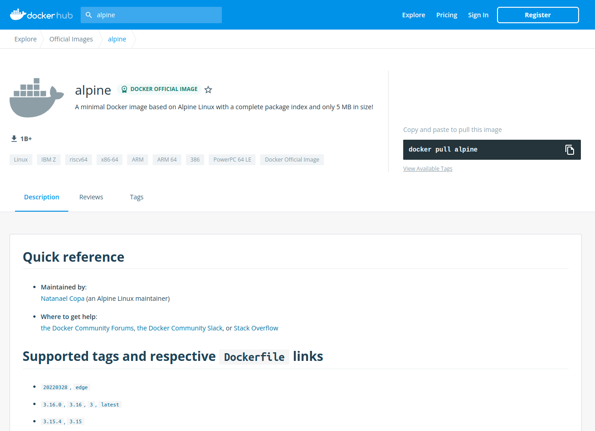

# Projeto Docker Todo List

Este foi o projeto de "Boas vindas" do módulo de back end.

Nele, fomos responsáveis por gerenciar alguns containeres no Docker. Além disso, manipulamos também imagens do DockerHub. Para finalizar, desenvolvi também um docker-compose, responsável por hospedar um projeto FullStack e os seus respectivos testes.

---

# Habilidades

- Instalar o Docker e executar um contêiner;
- Utilizar os principais comandos para utilização do Docker na interface de linha de comando (CLI);
- Rodar imagens do Docker Hub (repositório oficial de imagens do Docker).

---

## Requisitos

Ao todo, incluindo os bônus, foram 12 requisitos:

#### 1. Crie um container em modo interativo, sem rodá-lo, nomeando-o como 01container e utilizando a imagem alpine na versão 3.12;

#### 2. Inicie o container 01container;

#### 3. Liste os containers filtrando pelo nome 01container;

#### 4. Execute o comando cat /etc/os-release no container 01container sem se acoplar a ele;

#### 5. Remova o container 01container;

#### 6. Faça o download da imagem nginx com a versão 1.21.3-alpine sem criar ou rodar um container;

#### 7. Rode um novo container com a imagem nginx com a versão 1.21.3-alpine em segundo plano nomeando-o como 02images e mapeando sua porta padrão de acesso para porta 3000 do sistema hospedeiro;

#### 8. Pare o container 02images que está em andamento;

### Dockerfile

#### 9. Gere uma build a partir do Dockerfile do back-end do todo-app nomeando a imagem para todobackend;

#### 10. Gere uma build a partir do Dockerfile do front-end do todo-app nomeando a imagem para todofrontend;

#### 11. Gere uma build a partir do Dockerfile dos testes do todo-app nomeando a imagem para todotests;

### Requisito bônus

#### 12. Suba uma orquestração em segundo plano com o docker-compose de forma que backend, frontend e tests consigam se comunicar;
